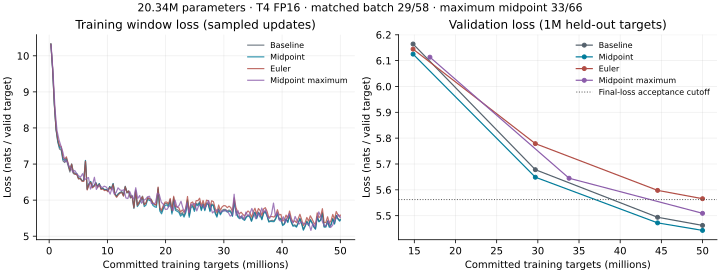

# Core assignment report — reversible training on a T4

Report date: 2026-10-06. Training dates: baseline 2026-09-27; reversible runs 2026-10-04. Stages 1–6 are complete for the specified small-scale experiment. This report is submitted for Admin review; no optional extension or GPU-utilization experiment has been started.

## Conclusion

Reversibility provides a **measured memory and physical-batch-capacity benefit, but not a training-time or estimated compute-cost saving**, for this implementation, model, context and accelerator.

- At identical batches, midpoint reduces peak allocated CUDA memory by **12.9031%**, improves final validation loss by 0.01927 nats, but takes **25.0992% longer** than ordinary autograd.
- The selected midpoint supports physical batch **33 rather than 29**, a **13.7931% capacity increase** under the same 10% reserved-memory headroom rule.
- At batch 33, midpoint recovers some throughput but remains **12.1165% slower** than baseline. It passes the unchanged loss cutoff, with worse final loss than matched midpoint. Effective batch increases from 58 to 66, creating an optimization confound.
- Hamiltonian Euler fails the predeclared quality threshold despite passing correctness gates.
- Batch 33 is the **protocol-qualified maximum**, not the largest batch that can execute. Batches 34 and 36 complete short probes but violate headroom. No utilization trace establishes full GPU compute utilization. No inflection point, B200 performance, or 70B/pretraining savings is established by this experiment.

## Artifact provenance and independent audit

The new Google Drive export is split across two local folders, not two independent experiments:

- `artifacts-20261004T124446Z-1-001/artifacts`: logs, configs, dataset, capacity records, summaries and most checkpoints.
- `artifacts-20261004T124446Z-1-002/artifacts`: maximum midpoint `latest.pt` and matched Euler `best.pt`.

The authoritative original Drive root is `/content/drive/MyDrive/Reversability/baseline-recovery-7bldlite/artifacts`. Logs/checkpoints are persistent under its `reversible-v1` directory. Preserve both export folders and ZIPs outside Git; neither part alone contains the complete reversible checkpoint set. No artifact was moved, overwritten or deleted during the audit.

The [machine-readable audit](analysis/core-audit-2026-10-06.json) records original configurations, commands, timestamps, summaries, event counts, validation points, capacity attempts and checkpoint hashes. It verifies all seven full/smoke streams, ten reversible latest/best checkpoints, all 25 frozen execution-source files and all four recorded data/tokenizer assets. The checkpoint-free recovery export's inherited `artifact-inventory.json` lists original baseline checkpoints that are not included in these two parts; it is not a current complete export manifest. Baseline checkpoints were independently audited in the [original baseline export](baseline-artifact-audit-2026-10-01.md).

Checkpoint checks include exact target cursors/budgets, update counts, config/manifest hashes, final/best validation metadata, finite model/optimizer tensors, 20,340,736 unique stored model parameters, and optimizer/scaler/Python/NumPy/CPU/CUDA RNG fields. This is an evidence audit on CPU, not a GPU rerun or independent loss reevaluation. Local audit PyTorch is 2.9.1+cu128; recorded training PyTorch is 2.11.0+cu128.

Reproduce the audit without modifying exports:

```bash
python3 docs/analysis/audit_core_results.py --parts artifacts-20261004T124446Z-1-001 artifacts-20261004T124446Z-1-002 --output docs/analysis/core-audit-2026-10-06.json
```

## Frozen experiment controls

All variants have **20,340,736 trainable parameters**, exact count difference **zero**: dense decoder, seven layers, width 256, eight heads, SwiGLU width 1024, tied GPT-2 input/output weights, vocabulary 50,257, context 512, dropout zero and no linear biases. No MoE was used.

Hardware: one Tesla T4 per run, compute capability 7.5, recorded VRAM 15,637,086,208 bytes. Sessions match the accelerator class, not necessarily the same physical card. Software: Python 3.13.15, PyTorch 2.11.0+cu128, CUDA runtime 12.8, NumPy 2.1.3. Precision FP16 autocast with gradient scaling; compilation disabled; seed 1337.

Optimizer/schedule: AdamW, learning rate 0.0006, minimum 0.00006, warmup 1,000,000 targets, betas (0.9, 0.95), weight decay 0.1, gradient clipping 1.0; schedule indexed by committed targets. Checkpoint interval 100 optimizer updates; evaluation interval 500 updates plus final evaluation; each evaluation uses 1,000,000 held-out targets.

Data: FineWeb-Edu `sample-10BT`, requested revision `v1.0.0`, resolved `fc9850dff5e2d0f8f776efe41b24a1c49556cfc5`. GPT-2 tokenizer resolved revision `607a30d783dfa663caf39e06633721c8d4cfcd7e`. First validation token stream, then training stream; EOS after each document; uint16 storage. Same ordered streams and initialization mapping where possible across runs. Architecture recurrences differ, so this is not an identical-forward-function comparison.

| Frozen asset | SHA-256 |
| --- | --- |
| Data manifest | `71a12f5765cf37b7f5fb8753d51fa0828915a6db313ae20aef7fa9fb2e14df8a` |
| Ordered train binary | `8d71872e4d7024801e459a6c44942907a89ae946105eb0905968746a0652c738` |
| Ordered validation binary | `d5058ea280216a4504ac6c899028adfd1c5b236c3af9de5ff813dfc3e5ed61b1` |
| Reversible source manifest | `74aba6d276986fba0115c61a2779a4f998947e71adec171df9db3557dfbce919` |
| Maximum-run config | `0e80626ed2bd59f42adb246234e25b4d572ae894a5ad36559d8de5daa7f8af51` |

Full runs consume **exactly 50,000,000 valid training targets**, excluding validation, gates, smoke and capacity probes. Padding does not count. Matched regular updates have 29,696 targets; maximum updates have 33,792. Every full run's final partial update has 21,632 valid targets. These are short fixed-token-budget pretraining experiments, not evidence of sufficient training at large scale.

## Paper mapping, correctness and selection

Independent implementation of [Reversing Large Language Models for Efficient Training and Fine-Tuning](https://arxiv.org/pdf/2512.02056), not a pinned author-code reproduction. The supplied paper's Eq. 2.4 explicit midpoint uses h=0.5 and both initial boundary states equal to input embeddings; backward reconstructs using Eq. 2.5. Assignment “Euler/oiler” maps to the staggered Hamiltonian, symplectic-Euler-like update in Eqs. 2.8–2.9, **not forward Euler**. See the exact recurrences and reference/backward choices in [method specification](reversible-methods.md). Leapfrog was not implemented.

CPU tests and all **60 CUDA correctness cases** pass: both methods, FP64/FP32/FP16, reconstruction, outputs/loss, input/parameter gradients and scaled/clipped AdamW update comparisons. Maximum global optimizer-update relative L2 errors are 9.72278e-14 / 3.78595e-5 / 0.0173540, against fixed limits 1e-7 / 0.01 / 0.05. The earlier CPU optimizer-policy amendment is documented in the method specification; no post-outcome GPU tolerance or loss-threshold relaxation occurred.

Loss acceptance: final validation <= baseline 5.462294847167969 + 0.10 = **5.562294847167969**. Correctness first, loss acceptance second; then lowest final loss, throughput, memory. Midpoint alone qualifies; Euler exceeds the cutoff by 0.0033573535 nats. The [planning decision](review-decision-2026-10-04.json) was persisted before maximum execution, including failures, trajectories, memory/time findings and the user's availability statement: usage under one hour, restart possible, exact remaining quota unknown.

## Every full training run

All final losses are also the best recorded losses. Trainer times include training-process evaluation/checkpoint overhead; they exclude setup, gates, smoke, capacity search and notebook downtime.

| Run | Physical / accumulation / effective | Updates | Final / best validation | Final training-window loss | Trainer seconds | Valid targets/s | Peak allocated / reserved GiB |
| --- | --- | ---: | ---: | ---: | ---: | ---: | ---: |
| Baseline | 29 / 2 / 58 | 1,684 | 5.4622948472 | 5.4724449745 | 1,119.090 | 44,679.159 | 10.030179 / 12.765625 |
| Midpoint matched | 29 / 2 / 58 | 1,684 | 5.4430287568 | 5.4516894098 | 1,399.973 | 35,714.975 | 8.735979 / 11.517578 |
| Euler matched | 29 / 2 / 58 | 1,684 | 5.5656522007 | 5.5836167194 | 1,401.316 | 35,680.744 | 8.735124 / 11.517578 |
| Midpoint maximum | 33 / 2 / 66 | 1,480 | 5.5091217800 | 5.5230157615 | 1,254.685 | 39,850.652 | 9.891305 / 13.076172 |

Maximum midpoint vs baseline: allocated memory -1.3846%, reserved memory **+2.4327%**, throughput -10.8071%, time +12.1165%, final-loss delta +0.0468269329 nats. Maximum vs matched midpoint: time -10.3779%, throughput +11.5797%, loss +0.0660930232 nats. Memory values are total CUDA allocations/reservations, **not isolated activation memory**.

The maximum run cannot retain effective batch 58 with physical batch 33 and integer accumulation. Effective batch 66 (+13.7931%) and 1,480 updates replace 58 and 1,684 (204 fewer updates). This optimization confound is explicitly frozen in `maximum-batch-accounting.json`. Validation occurs at 16.896M, 33.792M and 50M targets, versus matched 14.848M, 29.696M, 44.544M and 50M: intermediate validation comparisons are not target-aligned, and the maximum run has one fewer evaluation. Its timing benefit over matched midpoint therefore cannot be attributed solely to improved GPU batching. Checkpoint counts also decrease from 17 to 15.

## Loss trajectories



The figure plots committed targets, not optimizer steps: 169 sampled training-window losses per matched/baseline run and 148 for maximum midpoint. Curves are raw sampled window losses, not every-update logs or smoothed estimates. Maximum validation decreases 6.1133024404 → 5.6448935596 → 5.5091217800 at 16.896M / 33.792M / 50M targets. Baseline, midpoint matched and Euler each decrease at all four recorded validation evaluations; full tables are in [matched audit](matched-run-audit-2026-10-04.md) and the machine-readable audit. One paired seed does not establish statistical significance.

Reproduce the plot:

```bash
python3 docs/analysis/plot_matched_results.py --artifacts artifacts-20261004T124446Z-1-001/artifacts --include-maximum --output docs/figures/core-loss-2026-10-06.svg
```

## Capacity search, probes and memory headroom

Fresh process per candidate, one optimizer-state initialization update plus three repeated complete updates, accumulation 2, FP16, same model/context and **10% reserved-memory headroom**. Search is not capped at its configured ceiling. Confirmation at chosen physical batch uses the actual maximum-run accumulation and passes independently.

| Search | Passing candidates | Executed but failed headroom | OOM | Selected |
| --- | --- | --- | --- | ---: |
| Baseline | 1, 2, 4, 8, 16, 24, 28, 29 | 30, 32 | None in recorded search | 29 |
| Midpoint | 1, 2, 4, 8, 16, 32, 33 | 34, 36 | 40, 48, 64 | 33 |

Batch 33 reserves 14,040,432,640 bytes, leaving **10.2107%** of recorded VRAM; allowed reserved limit is 14,073,377,587 bytes. Batch 34 reserves 14,455,668,736 bytes, leaving **7.5552%**; batch 36 reserves 15,290,335,232 bytes, leaving **2.2175%**. Their three losses are finite and repeated updates execute, but they do not meet the fixed rule. They are not full training runs or verified sustained-safe maxima. Batch 35 and the exact physical OOM boundary were not measured. Increasing the search ceiling alone would not change the established headroom boundary.

All candidate reports, measured losses, OOM errors, commands and probe timings are retained in the audit JSON. Peak reserved minus peak allocated is not a simultaneous fragmentation measurement; allocator reuse/temporary lifetimes may contribute. Nothing in the export measures GPU compute utilization, memory bandwidth utilization, power, MFU or synchronized steady-state throughput. VRAM occupancy must not be described as compute saturation.

## Smoke, partial attempts and restart history

| Separate smoke | Targets | Updates | Final / best validation | Trainer seconds |
| --- | ---: | ---: | ---: | ---: |
| Baseline | 65,536 | 3 | 10.6698841641 | 21.533655 |
| Midpoint | 65,536 | 3 | 10.6920480039 | 21.764737 |
| Euler | 65,536 | 3 | 10.8215066875 | 30.099976 |

All seven smoke/full streams have one zero-cursor startup, complete monotonic sampled target progression and no logged overflow retries. There are **no partial training segments in the supplied exports**. Baseline and matched audit documents describe their full startup/final timestamps. Maximum starts at **2026-10-04 12:06:21.614007 UTC**, final summary at **12:27:17.030046 UTC**. Its 1,255.416-second timestamp span is close to the 1,254.685-second monotonic process timing; timing methods are not identical. No `--resume` command appears for this completed maximum run.

Failures/recovery, kept separate from completed training:

1. Deleted/mislocated Drive artifacts initially prevented staging; the checkpoint-free baseline reference/data recovery preserved comparison inputs. These earlier failures are documented in Progress.md; not all original console traces are included here.
2. Two matched preflights rejected Torch cu130 vs frozen cu128 at 09:45:11 and 09:48:15 UTC on October 4; neither committed targets. Corrected matched orchestration begins at 10:13:17 UTC.
3. User reported a Drive transport disconnection and replacement T4 runtime. The export does not contain a partial maximum training segment from that lost runtime. Its work, duration and any unsaved targets cannot be reconstructed; do not assume zero wasted compute or claim that a missing attempt was resumed.
4. Maximum invocation at 12:01:29.982221 UTC fails on missing local dataset manifest after runtime restart; no training starts. Restaging original Drive data fixes this. Successful maximum orchestration begins at 12:04:24.627148 UTC.
5. Three maximum search candidates OOM, two fail headroom; these are expected capacity-probe failures, not full-training failures.

Successful maximum orchestration spans approximately **1,372.403 seconds** to the final summary, including environment/source/data checks, capacity processes and confirmation. This is an observed timestamp window, not the trainer's monotonic duration or a billable-session measurement. Full training processes total **5,175.064 seconds (1.4375 GPU-hours)** across four runs. Known smoke time adds 73.398 seconds; gates, search/process setup, Drive recovery, lost sessions and idle allocation are additional and not all comprehensively timed.

## Commands and configuration records

Original Colab execution commands are stored in startup events and capacity reports. Their absolute Drive paths are retained, not rewritten to local export paths. Maximum-stage orchestration:

```bash
/usr/bin/python3 -u /content/Reversability/scripts/run_reversible_study.py maximum --artifacts /content/drive/MyDrive/Reversability/baseline-recovery-7bldlite/artifacts --max-batch 256
```

Every full trainer uses `/content/Reversability/scripts/train_baseline.py --config <recorded config> --device cuda`: baseline `artifacts/configs/baseline_colab.json`, reversible matched `artifacts/reversible-v1/configs/{midpoint,euler}_matched.json`, maximum `artifacts/reversible-v1/configs/midpoint_maximum.json`. Smokes use their separately frozen configs and 65,536-target stop budgets. CUDA gate and staging commands are preserved in their logs and previous audits. Exact per-candidate commands are embedded in capacity attempt records. The audit JSON stores complete startup commands/configurations rather than abbreviated reconstructions.

## Estimated compute cost, not measured Colab spend

For an explicitly illustrative accelerator-only estimate, use Google Cloud Compute Engine's listed **Iowa (us-central1) NVIDIA T4 GPU price USD 0.35/hour**, accessed 2026-10-06. This is not the Colab plan price or a verified historical bill; regional/SKU pricing and VM resources must be checked before purchase. [Google Cloud GPU pricing](https://cloud.google.com/products/compute/gpus-pricing?hl=en)

| Full run | Trainer GPU-hours | Illustrative accelerator-only USD |
| --- | ---: | ---: |
| Baseline | 0.310858 | 0.10880 |
| Midpoint matched | 0.388881 | 0.13611 |
| Euler matched | 0.389254 | 0.13624 |
| Midpoint maximum | 0.348524 | 0.12198 |

Formula: measured trainer seconds / 3,600 × quoted GPU hourly rate. Four full runs total approximately **USD 0.50313**, excluding smoke, gates, search, setup, failed/lost attempts, idle allocation, VM CPU/RAM, storage/transfer charges and taxes. Storage/transfer quantities and rates were not measured; they are **unknown, not zero**. Colab compute units and actual spend were not supplied. At any identical constant accelerator rate, maximum midpoint's trainer-only cost ratio is 1.12117 vs baseline; matched midpoint's is 1.25099. No monetary saving is demonstrated.

## Interpretation and limits

Measured: quality-qualified midpoint trades extra reconstruction work for lower allocated memory and larger feasible batches. Larger batches partially recover throughput, but do not overcome overhead in this seven-layer, context-512 T4 setting. Euler is not selected. The maximum run's final loss remains acceptable but its different effective batch/update count prevents a clean quality or speed attribution.

Code-level observation: the current model materializes full `(batch, sequence, vocabulary)` logits, and both trainer and capacity probe call ordinary cross-entropy. At batch 33/context 512/vocabulary 50,257, one FP16 logits tensor alone represents **1.582 GiB**; a same-shaped FP32 tensor represents **3.163 GiB**. PyTorch documents CUDA autocast cross-entropy as FP32. The batch-40 OOM requests 3.84 GiB, consistent with a same-shaped FP32 buffer, but the exact allocation site and live-buffer composition require a profiler. This is a **plausible non-reversible memory bottleneck**, not measured attribution of all missing savings. [PyTorch 2.11 AMP operation reference](https://docs.pytorch.org/docs/2.11/amp.html#cuda-ops-that-can-autocast-to-float32)

Unestablished: activation-only memory savings, fragmentation attribution, GPU saturation, steady-state kernel efficiency, time-to-equal-quality, statistical significance, scaling inflection, and B200/70B savings. More pretraining tokens cannot by themselves reverse a throughput penalty. A different GPU does not imply either algorithm retains the T4's scaling ratios. No B200 or 70B extrapolation was manufactured to turn this measured loss into a claimed win.

The core assignment is complete and submitted. **Admin acceptance remains pending.** Deferred methods and scaling remain inactive; GPU-utilization/capacity optimization is not part of this frozen result. Preserve these measurements as the reference for any later explicitly authorized phase.
