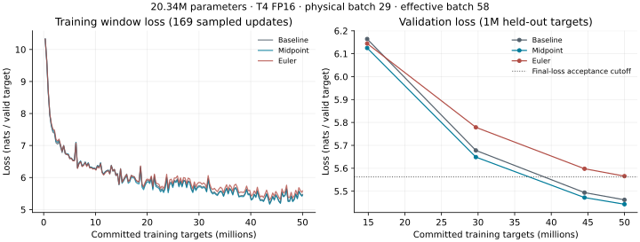

# Matched reversible-run audit and planning-review findings — 2026-10-04

## Outcome and remaining assignment

Midpoint is the sole quality-qualified variant for the maximum-batch stage. It has slightly lower validation loss and lower GPU memory than the baseline, but takes longer at the matched batch size. Euler fails the predeclared loss cutoff. No maximum-batch advantage, monetary saving or scaling inflection has been established.

Stages 1–3 have complete run evidence and stage 4's selection rule identifies midpoint. The planning review is now recorded: the user reports under one hour of Colab usage and can restart; exact remaining quota is unknown. Maximum-batch capacity/training and the final core report remain pending. This document is an interim audit, not the completed assignment report.

## Evidence and provenance

Imported root: `artifacts-20261004T112021Z-1-001/artifacts`; reversible study: `reversible-v1/`. Preserve the original directory and ZIP outside Git. Baseline checkpoints remain in the earlier local export documented in [the baseline audit](baseline-artifact-audit-2026-10-01.md); the checkpoint-free recovery export does not contain them.

Checked structured metrics, summaries, console/orchestration logs, frozen configs, data/tokenizer hashes, source ZIP/manifest, CUDA gate report and all eight reversible latest/best checkpoints. These checks inspect recorded evidence on CPU; they do not rerun GPU training or independently reevaluate held-out loss.

## Full-run comparison

All three full runs train on exactly 50,000,000 FineWeb-Edu targets and evaluate the same 1,000,000 held-out targets. Each has 20,340,736 trainable parameters, physical batch 29, accumulation 2, effective batch 58, context 512, seed 1337 and 1,684 updates. Regular windows contain 29,696 valid targets; the final window contains exactly 21,632. Exact parameter-count difference is zero.

| Measurement | Ordinary autograd | Midpoint, h=0.5 | Hamiltonian Euler |
| --- | ---: | ---: | ---: |
| Final / best validation loss, nats | 5.4622948472 | 5.4430287568 | 5.5656522007 |
| Final training-window loss | 5.4724449745 | 5.4516894098 | 5.5836167194 |
| End-to-end trainer seconds | 1,119.090 | 1,399.973 | 1,401.316 |
| End-to-end valid targets/s | 44,679.159 | 35,714.975 | 35,680.744 |
| Peak allocated GPU GiB | 10.030179 | 8.735979 | 8.735124 |
| Peak reserved GPU GiB | 12.765625 | 11.517578 | 11.517578 |
| Quality-qualified | Reference | Yes | No |

Midpoint versus baseline: validation-loss delta **-0.0192660903 nats**, allocated-memory reduction **12.9031%**, reserved-memory reduction **9.7766%**, trainer time increase **25.0992%**, and throughput reduction **20.0635%**. Allocated-memory reduction is 1.2942 GiB. These are total CUDA allocations/reservations, not an isolated activation-memory measurement. Lower memory has not translated to a matched-batch speed advantage. At the same hypothetical hourly GPU price, training-process compute cost would follow the time ratio; no actual price, spend or Colab compute-unit measurement was supplied.

The loss acceptance rule is unchanged: final loss <= 5.462294847167969 + 0.10 = **5.562294847167969**. Midpoint qualifies. Euler's loss delta is +0.1033573535 nats and exceeds the cutoff by **0.0033573535**. Do not relax the cutoff after observing these outcomes. The single paired seed and small midpoint loss advantage do not establish statistical significance.

## Loss trajectories

| Optimizer step | Committed targets | Baseline validation | Midpoint validation | Euler validation |
| ---: | ---: | ---: | ---: | ---: |
| 500 | 14,848,000 | 6.1642629458 | 6.1250958086 | 6.1444386309 |
| 1,000 | 29,696,000 | 5.6779289814 | 5.6488226064 | 5.7787491606 |
| 1,500 | 44,544,000 | 5.4938018132 | 5.4721031528 | 5.5978780791 |
| 1,684 | 50,000,000 | 5.4622948472 | 5.4430287568 | 5.5656522007 |

Validation decreases at every recorded evaluation for each method; midpoint beats the baseline at all four. There are 169 sampled training-window loss events per full run, not an every-update loss record. Full trajectories are retained in each `metrics.jsonl`.



## Restart/resume and failures

The user reported a resumed run; the supplied export distinguishes restarting the workflow from resuming training. Both reversible full runs and both smokes have exactly one startup, `resumed_from_targets=0`, no `--resume` command, and complete monotonic target progression. Neither full run has an interrupted/resumed training segment in this evidence.

`matched-orchestration.log` records two aborted environment preflights at 09:45:11 and 09:48:15 UTC: installed `2.11.0+cu130` differed from the baseline's `2.11.0+cu128`. They committed no training targets. Corrected orchestration began at 10:13:17 UTC and preserved the unused frozen setup under `preflight-history/3d7d46c7aae245bda8e8552de3d09318`. No mixed-precision overflow events or training-process tracebacks are present. Earlier dataset-location/deleted-Drive recovery failures are recorded separately in Progress.md; their original logs are not all included in this export.

| Run | Startup UTC | Final summary UTC | Monotonic trainer time |
| --- | --- | --- | ---: |
| Midpoint full | 10:14:15.498247 | 10:37:35.478108 | 1,399.972978 s |
| Euler full | 10:38:16.522274 | 11:01:37.844429 | 1,401.316091 s |

Both dates are 2026-10-04. Timestamp durations (1,399.979861 / 1,401.322155 seconds) agree with the monotonic summaries to milliseconds. Since each exported run has one process starting from zero, no resumed-time summation is necessary. If another training attempt existed outside this export, it is not represented here and must be logged separately rather than inferred.

## Correctness and separate smoke runs

`correctness/cuda.json`: **60 cases passed** on Tesla T4, PyTorch 2.11.0+cu128, Python 3.13.15. Coverage includes both methods, FP64/FP32/FP16, seeds 1337/2026, depths 1/3/7, multiple lengths and midpoint step sizes, plus full-width/context core probes. Reconstruction, reference outputs/loss, input/parameter gradients and clipped/scaled AdamW updates pass the predeclared v2 policy. Gate source hashes match the frozen source snapshot.

| Precision | Maximum relative optimizer-update L2 error | Acceptance limit |
| --- | ---: | ---: |
| FP64 | 9.72278e-14 | 1e-7 |
| FP32 | 3.78595e-5 | 0.01 |
| FP16 | 0.0173540 | 0.05 |

| Separate smoke | Targets | Steps | Final validation loss | Trainer seconds |
| --- | ---: | ---: | ---: | ---: |
| Baseline | 65,536 | 3 | 10.6698841641 | 21.533655 |
| Midpoint | 65,536 | 3 | 10.6920480039 | 21.764737 |
| Euler | 65,536 | 3 | 10.8215066875 | 30.099976 |

Smoke/probe/preflight work is excluded from each full 50M-target budget. No new numerical-policy amendment was made for these GPU runs; the earlier CPU optimizer-policy amendment remains documented in [reversible methods](reversible-methods.md).

## Frozen controls and verified integrity

- Same recorded accelerator class: one Tesla T4, compute capability 7.5, 15,637,086,208 bytes VRAM. These are different Colab sessions, not evidence of the same physical card. Python 3.13.15, PyTorch 2.11.0+cu128, NumPy 2.1.3 and PyTorch CUDA runtime 12.8 match. Original baseline is dated 2026-09-27, reversible runs 2026-10-04.
- Same pinned FineWeb-Edu sample-10BT/GPT-2 tokenizer revisions and ordered binaries as the baseline. Manifest SHA-256: `71a12f5765cf37b7f5fb8753d51fa0828915a6db313ae20aef7fa9fb2e14df8a`. Both binary sizes/hashes and both tokenizer assets pass.
- Training SHA-256: `8d71872e4d7024801e459a6c44942907a89ae946105eb0905968746a0652c738`; validation: `d5058ea280216a4504ac6c899028adfd1c5b236c3af9de5ff813dfc3e5ed61b1`.
- Architecture, optimizer, target-indexed schedule, evaluation cadence and initialization mapping agree with the protocol. Method recurrences differ; this is not an identical-forward-function comparison.
- Current source manifest SHA-256: `74aba6d276986fba0115c61a2779a4f998947e71adec171df9db3557dfbce919`; all **25** corresponding ZIP entries match. All frozen execution-source files also match the current local checkout. New audit/Progress documents do not alter the frozen training source.
- Midpoint matched config SHA-256: `5941a4ea5768a74251162ef3527784d7fa1b8d7cbdaba45a5c6876849dbb9395`; Euler: `06e5650b7419c68d253880f400ac95aa482133380d2ddb95de758f34d57951f7`. Their hashes match startup events; all four reversible smoke/full summary files match their final logged summaries.
- CUDA report SHA-256: `0960e74fc9821bc2173fabe93e22c11e7af67d8fc3630a0b5a6a01caac059ad5`. Review proposal: `e2f93e3b75b411af37d97c51121d9acb5f0a74c172d91216ef946a9190a75a22`.
- All eight reversible latest/best checkpoints load on CPU. Budget, target cursor, optimizer step and final/best validation fields agree with summaries. Unique stored model tensors total 20,340,736 parameters; model and optimizer tensors are finite. Adam, scaler and Python/NumPy/CPU/CUDA RNG state are present.

| Full-run checkpoint | SHA-256 |
| --- | --- |
| Midpoint latest | `a4354bf4551fe58aed2865c862c945fee8b532294bd09069e764cc47bd23fdda` |
| Midpoint best | `7d708a8238064c44540fab22e42b0419cd7b7ac541e9e8b1f45d138d2d022cd4` |
| Euler latest | `2af1da0f9c68b9769bc68564cabcdc9ac0fd86c1ccf2068a169e3b5d7ba1a91e` |
| Euler best | `5f6fe331a4ecad92854ceeefdefa44bf3ee4a5ad69b1dc57f15adaf29026aa9d` |

## Commands and verification method

Recorded commands use the original Colab locations:

```bash
/usr/bin/python3 /content/Reversability/scripts/validate_reversible.py --device cuda --output /content/drive/MyDrive/Reversability/baseline-recovery-7bldlite/artifacts/reversible-v1/correctness/cuda.json
/usr/bin/python3 -u /content/Reversability/scripts/train_baseline.py --config /content/drive/MyDrive/Reversability/baseline-recovery-7bldlite/artifacts/reversible-v1/configs/midpoint_matched.json --device cuda
/usr/bin/python3 -u /content/Reversability/scripts/train_baseline.py --config /content/drive/MyDrive/Reversability/baseline-recovery-7bldlite/artifacts/reversible-v1/configs/euler_matched.json --device cuda
```

Local inspection used `json.loads`/event counts over all six smoke/full streams; assertions on startup cursor, sampled target progression, exact final partial window and summary agreement; streamed `hashlib.sha256` checks for data/assets/configs/source/checkpoints; `zipfile.ZipFile` to verify the frozen source; and `torch.load(..., map_location='cpu', weights_only=False)` plus tensor-finiteness, unique-storage parameter count and RNG/optimizer/scaler checks. All checks passed. No GPU experiment was launched locally.

Reproduce the loss figure with:

```bash
python3 docs/analysis/plot_matched_results.py --artifacts artifacts-20261004T112021Z-1-001/artifacts --output docs/figures/matched-loss-2026-10-04.svg
```

## Planning checkpoint and next step

Select **midpoint**, preserving h=0.5 and all correctness/loss criteria. The imported export predates the decision and has no maximum capacity report or maximum run. The user subsequently confirmed under one hour of usage and ability to restart Colab; exact remaining compute units/runtime are unknown and a new T4 must pass the existing gates. The [recorded decision](review-decision-2026-10-04.json) sets `planning_session_recorded=true`; no protocol amendment was made.

Restart a T4 runtime if needed, keep Drive artifacts intact, and run the existing [reversible notebook](../notebooks/reversible_colab.ipynb) setup/data/review cells. Completed smoke/matched runs are skipped by the runner. Refresh the checkout and execute this additional cell:

```python
run_logged(['git', 'pull', '--ff-only'])
exec((REPO / 'docs/maximum-run-colab-cell.py').read_text())
```

The [handoff cell](maximum-run-colab-cell.py) checks exact audited proposal/source/CUDA hashes before saving `ARTIFACTS/reversible-v1/review-decision.json` to Drive. It preserves any differing existing decision and launches the existing maximum runner with logs at `ARTIFACTS/reversible-v1/maximum-orchestration.log`. Handoff/docs changes do not modify frozen training source. Do not restart training from scratch or delete the recovered artifact root.

After recording the review, execute the existing `maximum` phase on the same T4/software and frozen source. It searches repeatedly successful physical batches under 10% reserved-memory headroom, confirms actual accumulation, and starts a fresh 50M-target run. Effective batch 58 must be preserved when feasible; otherwise explicitly report changed batch/update count and the optimization confound. No capacity, runtime or quality outcome is predicted here.

Timing includes training-process evaluation/checkpoint overhead, but excludes setup/recovery, CUDA gates, smokes, capacity searches and notebook/offline downtime. No synchronized steady-state throughput window, measured service cost, isolated activation-memory breakdown, statistical replication or scaling grid exists. Complete these reporting qualifications in the final core report without expanding the active assignment.
